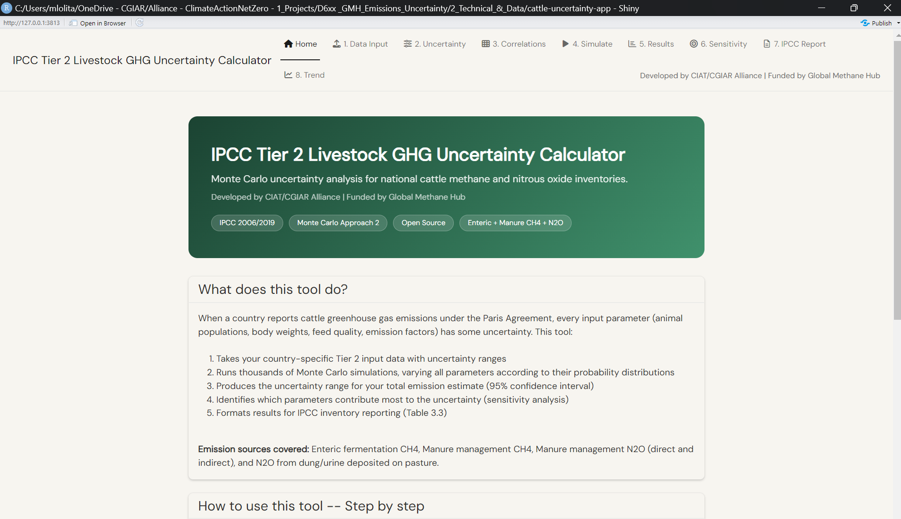
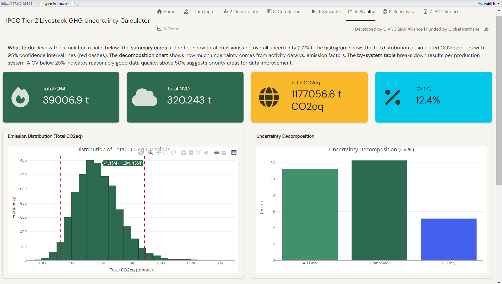
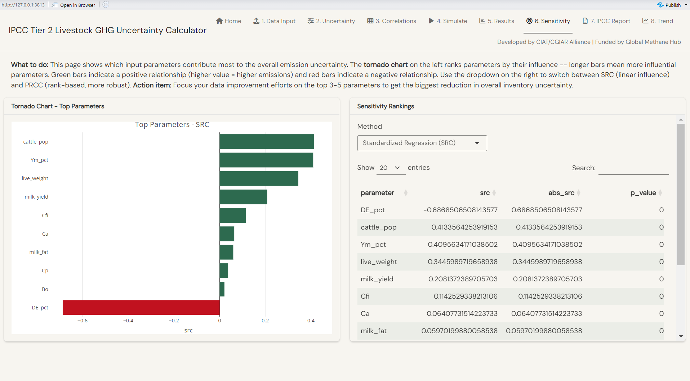

# IPCC Tier 2 Livestock GHG Uncertainty Calculator

[](https://mlolita26.shinyapps.io/cattle-ghg-uncertainty/)
[](https://mybinder.org/v2/gh/ERAgriculture/cattle-ghg-uncertainty/HEAD?urlpath=shiny)
[](LICENSE)
[](https://www.r-project.org/)

A web-based tool for national cattle GHG inventory teams to quantify and report uncertainty in their IPCC Tier 2 emission estimates. Upload your country data, run 10,000 Monte Carlo simulations, and download results formatted directly for IPCC Table 3.3 — no coding required.

**Developed by** CIAT / CGIAR Alliance of Bioversity International and CIAT  
**Funded by** Global Methane Hub (Grant R-2026-01051)

---

## Run the app — no installation needed

There are two ways to run the app in your browser without installing R or writing any code.

### Option A — shinyapps.io (recommended)

> Fast, persistent, no waiting time. The app is live and ready.

Click the green **Launch App** badge above, or go to:  
**https://mlolita26.shinyapps.io/cattle-ghg-uncertainty/**

### Option B — Binder (zero account, slower start)

> Free, no account needed. **First load takes 3–8 minutes** while the environment builds. Subsequent loads are faster.

Click the **launch binder** badge above. Once the environment is ready, the app opens automatically in your browser.

---

## Screenshots

<table>
<tr>
<td><br><sub><b>Home</b> — overview and quick-start guide</sub></td>
<td><br><sub><b>Results</b> — emission distribution, 95% CI, uncertainty decomposition</sub></td>
<td><br><sub><b>Sensitivity</b> — tornado chart ranking parameters by uncertainty contribution</sub></td>
</tr>
</table>

---

## What this tool does

When a country reports cattle greenhouse gas emissions under the Paris Agreement, every input — animal populations, body weights, feed quality, emission factors — has uncertainty attached to it. This tool propagates that uncertainty through the full IPCC Tier 2 equation chain so you can report not just a single emission number, but a defensible confidence interval.

**Emission sources covered:** Enteric fermentation CH₄ · Manure management CH₄ · Direct N₂O from manure · Indirect N₂O (atmospheric deposition + leaching)

| Feature | Detail |
|---|---|
| Methodology | IPCC 2006 Guidelines Vol. 4 Ch. 10–11; 2019 Refinement supported |
| Simulation | 10,000 Monte Carlo iterations (configurable) |
| Correlations | Gaussian copula for activity data; uniform equicorrelation for emission factors |
| Uncertainty decomposition | Activity data vs. emission factors, side-by-side |
| Sensitivity analysis | Standardised Regression Coefficients (SRC) + PRCC tornado chart |
| Reporting output | IPCC Table 3.3 formatted XLSX / CSV download |
| Input format | Excel template with dropdowns, formulas, and colour-coded guidance |
| Example data | Uganda dairy cattle (pre-loaded, no upload needed to explore) |

---

## Tool structure — 9 tabs

| Tab | Purpose |
|---|---|
| **Home** | Overview, quick-start guide |
| **1. Data Input** | Load example data or upload your Excel template; inline editing |
| **2. QA/QC** | Automated traffic-light checks (bounds, IPCC defaults, fractions) |
| **3. Uncertainty** | Review and adjust distributions and bounds per parameter |
| **4. Correlations** | Upload historical time series for activity data; set emission factor correlation |
| **5. Simulate** | Choose iterations, GWP version, run Monte Carlo |
| **6. Results** | Histogram, 95% CI, decomposition chart, by-system table |
| **7. Sensitivity** | Tornado chart, SRC/PRCC ranking table |
| **8. IPCC Report** | IPCC Table 3.3 output; download XLSX or CSV |
| **9. Trend** | *(coming in next release)* Multi-year uncertainty bands |

---

## Input data — Excel template

The app expects a single Excel workbook with up to 6 sheets. **Only the `Parameters` sheet is required.**

| Sheet | Required? | Purpose |
|---|---|---|
| `Parameters` | **Yes** | One row per (sub-category × parameter): values, uncertainty %, bounds, distribution |
| `Inventory_Metadata` | Optional | Country, year, species, IPCC version |
| `Manure_Management` | Optional | MMS type allocation with MCF and EF3 values |
| `Parameter_TimeSeries` | Optional | Year-by-parameter historical data → automatic correlation estimation |
| `Vocab` | Auto-generated | Reference tables (read-only) |

**Download the template from inside the app** (Tab 1 → "Download Template"), fill it in, and upload it back. The template includes dropdowns, pre-filled IPCC defaults, Excel formulas for bounds, and a colour-coded guide.

**Quick start without uploading anything:** go to Tab 1, select *Uganda (Example)*, then go to Tab 5 and click *Run Monte Carlo Simulation*.

---

## Run locally

If you prefer to run the app on your own machine:

**1. Install R (≥ 4.3)** from [r-project.org](https://www.r-project.org/) and optionally [RStudio](https://posit.co/download/rstudio-desktop/).

**2. Install dependencies** — run this once in the R console:

```r
source("install.R")
```

**3. Launch the app:**

```r
shiny::runApp(".")
```

The app opens in your default browser.

---

## Repository structure

```
cattle-ghg-uncertainty/
├── app.R                        # Entry point — sources R/ and launches app
├── install.R                    # One-line dependency installer
├── runtime.txt                  # Binder R version specification
├── deploy_shinyapps.R           # shinyapps.io deployment script
│
├── R/
│   ├── app_ui.R                 # Shiny UI (9-tab page_navbar)
│   ├── app_server.R             # Reactive server logic
│   │
│   ├── calc_energy.R            # Net energy equations (NEm, NEa, NEg, NEl, NEw, NEp)
│   ├── calc_enteric.R           # Enteric CH4 (IPCC Eq 10.21)
│   ├── calc_manure_ch4.R        # VS and manure CH4 (Eq 10.23–10.24)
│   ├── calc_manure_n2o.R        # N excretion, direct and indirect N2O
│   ├── calc_ghg_master.R        # Master emission function (calls all calc_*)
│   │
│   ├── mc_sampling.R            # Gaussian copula engine; make_uniform_corr()
│   ├── mc_simulation.R          # run_mc_simulation(); run_inventory_simulation()
│   ├── mc_uncertainty.R         # Uncertainty metrics and AD/EF decomposition
│   ├── mc_sensitivity.R         # SRC and PRCC sensitivity analysis
│   │
│   ├── utils_ipcc_defaults.R    # IPCC lookup tables and controlled vocabularies
│   ├── utils_template.R         # Excel template generation and parsing
│   ├── utils_timeseries_template.R  # Standalone time series template for Tab 4
│   ├── utils_distributions.R    # sample_distribution(); transform_marginal()
│   ├── utils_validation.R       # validate_param_specs()
│   ├── utils_qaqc.R             # run_qaqc() — 6 automated checks per parameter
│   └── utils_export.R           # XLSX/CSV report generation
│
├── www/                         # Custom CSS
├── docs/
│   └── correlations.md          # Technical documentation: Gaussian copula design
├── figures/                     # Static figures used in the UI
└── TECHNICAL_SUMMARY.md         # Full technical reference (equations, variables, design)
```

---

## Correlation handling

The tool uses a **Gaussian copula** to preserve pairwise correlations between activity data parameters during Monte Carlo sampling. Upload a year-by-parameter time series in Tab 4 and the tool computes the correlation matrix automatically from your historical data.

For emission factors, an optional **uniform equicorrelation** (single slider ρ) represents systematic methodological bias in the IPCC equation structure. ρ = 0 is the IPCC Approach 2 default; the tool recommends starting at ρ = 0.3 if you suspect shared bias. See [docs/correlations.md](docs/correlations.md) for the full technical specification.

---

## Deploy your own instance

To host the app on [shinyapps.io](https://www.shinyapps.io/) (free tier: 5 apps, 25 active hours/month):

1. Create a free account at [shinyapps.io](https://www.shinyapps.io/)
2. In RStudio, go to **Tools → Global Options → Publishing** and connect your account
3. Edit `deploy_shinyapps.R` with your username, then run:

```r
source("deploy_shinyapps.R")
```

---

## Citation

If you use this tool in published work, please cite:

> Muller, L., *et al.* (2026). *IPCC Tier 2 Livestock GHG Uncertainty Calculator* (v2.1). CIAT/CGIAR Alliance of Bioversity International and CIAT. GitHub: https://github.com/ERAgriculture/cattle-ghg-uncertainty

---

## Funding and acknowledgements

This tool was developed as part of project **D614 — GMH Emissions Uncertainty** funded by the **Global Methane Hub** (Grant R-2026-01051), implemented by the CGIAR Alliance of Bioversity International and CIAT (ClimateActionNetZero initiative).

---

## License

MIT © CGIAR Alliance of Bioversity International and CIAT, 2026
